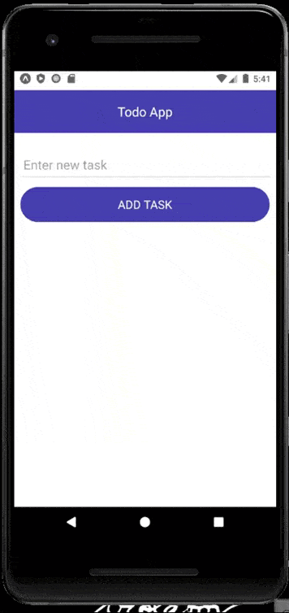

## todo app in vue-native



### Installation step
• Clone the repository.<br />
• Navigate to project directory and do ```yarn```.<br />
• ```yarn start``` to run the project.<br />
Similiarly you can do ```npm run android``` for building in simulator.
